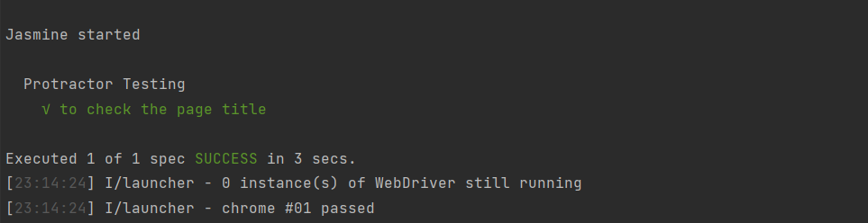
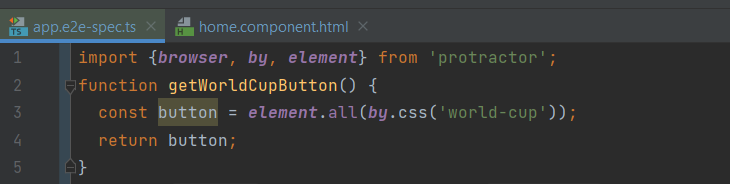
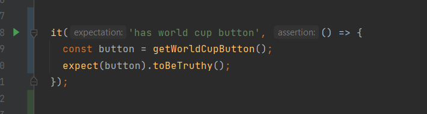
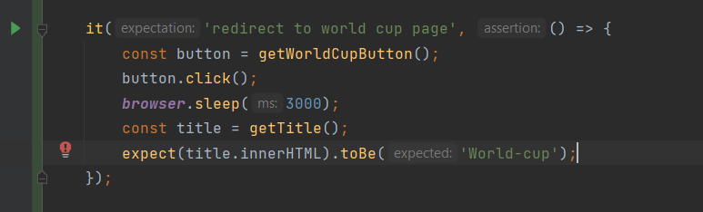

**End-to-end testing (E2E)** of Angular applications is performed using the Protractor testing framework, which is created by the Angular team themselves. Protractor can perform end to end tests on Angular applications that are running in a real browser by interacting with it, similar to that of an end-user.

Using Protractor:

 

.png).png)

Result: 

 

We now can continue writing the tests:

checing if the world cup button is there :

 

 

 
Testing if the button redirection works:

 

