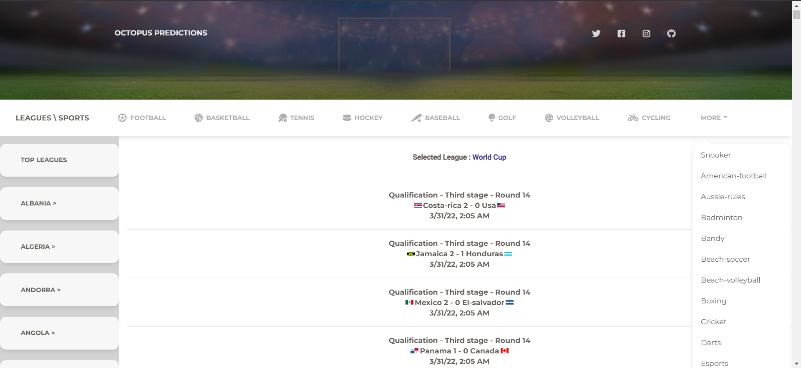
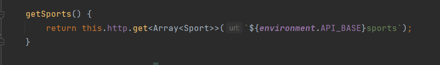
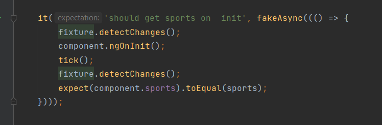
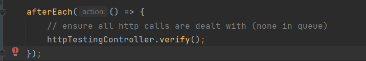
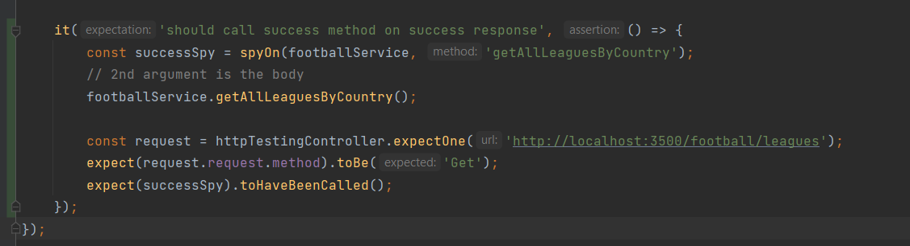

Code Source: 
- <a href='https://github.com/bacembendaly99/octopus-predictions-frontend/blob/dev/src/app/components/home/home.component.spec.ts'>home.component.spec.ts</a> 

 

**Integration testing**: Here, we test the integration of two or more units. Integration tests usually require external resources like network and database. An integration test does not test a complete workflow, nor does it test an isolated unit.

Here we are going to be testing the component Home.

 

First we will test the sports list which is requested from the backend. 

Using the Fakeasync feature in Jasmine and the Tick() function that wait for all observables to be called and finished.

This test will make sure all http requests are dealt with

Now we will test the type of http request to be GET :
